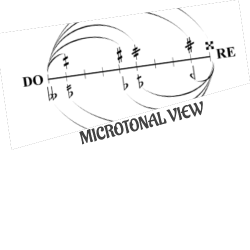
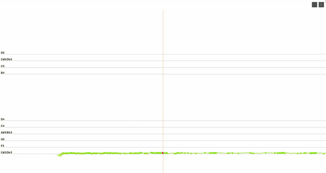

  

# MicrotonalView

> Displays the microtonality and the nuances in music that notations cannot capture.

MicrotonalView is a tool for visualizing pitch data from audio files. It provides a graphical interface to display pitch data and allows users to interact with the visualization.

[Watch with sound on YouTube](https://youtu.be/zC3XGvqq0Qg)

## How to use

1. Clone the repository.
2. Install `uv` package manager for Python. [https://docs.astral.sh/uv/](https://docs.astral.sh/uv/getting-started/installation/)
3. Type `make run`.
4. Select an audio file (in .wav format) to visualize.

### Making a video

It is also possible to make a video by running the program and capturing the screen.
To make a video see the `Makefile` for the command.

## Next steps

- [ ] Make all pixels and sizes relative to the screen resolution.
- [ ] Simplify the EventHandler module.
- [ ] Add a theme via a configuration file.
- [ ] Make the button and text sizes consistent.
- [ ] Generate an executable
- [ ] Put some example audio as package data (have another view for users to select them)

## Contributing

The project is in its alpha version. Please feel free to report issues using github's issue tracker. Pull requests are also welcome :).
